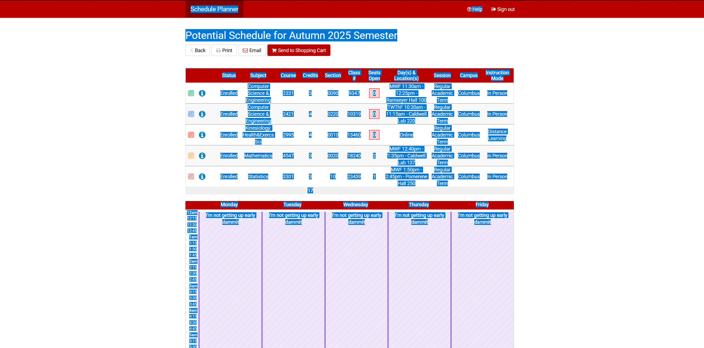
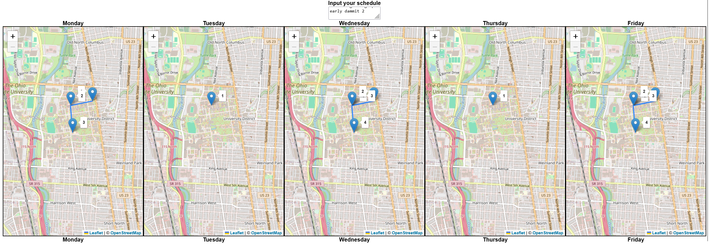

# OsuScheduleMap

This a web-based app for mapping where your Ohio State classes are. This was built using Angular, and classes are mapped using the [Ohio State geocoder](https://gissvc.osu.edu/arcgis/rest/services/Apps/Campusmap_OSU_Buildings_Locator/GeocodeServer/).

# Usage
To use, open the website at https://tzheng7679.github.io/OSU_Schedule_Mapper/. Then, open your schedule in OSU's Schedule Planner and copy everything (Ctrl + A, then Ctrl + C).

> 
<i> Yes this is my actual schedule. Please don't use it for nefarious purposes. </i>

 

Then, come back to my website, and paste it into the textbox at the top. Your planned classes will then show up in the maps. 

For each day, each location is labeled by what order the classes are in (e.g. if your second class of the day is at Dreese Labs, then a marker on Dreese will be labeled with a 2). Clicking/tapping a marker on the map will show you the details for the class. 

If you have multiple classes in the same location, it will be labeled for each class; tapping on the marker will cause multiple markers to come out from the original marker - with each labeled by their order - and then you can click on any of the individual markers to view class details.